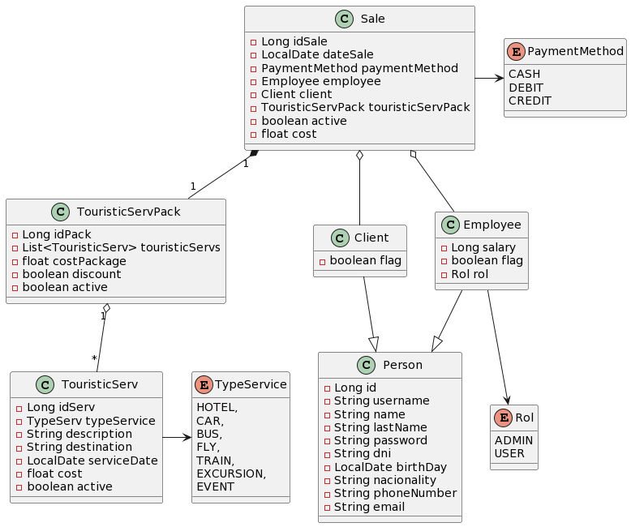

    

## TravelStation (Hackacode's project)
Welcome to the Hackacode-back-omega repository.

This api provides endpoints for sale's manage to a travel agency, services creation, services package etc.

This project was built using Java and Spring Boot for the creation and administration of endpoints. 
We used Spring Security with JWT tokens to manage users and roles.

## Requirements

- Java 17 or higher.
- Maven.
- MySql.

Below we have the uml diagram showing the class modeling:

    

To get started on how to set up the project, meet our technical guidelines, go to [our wiki](https://github.com/SebastianFurnier/Proyecto-omega/wiki)

For other useful information abou **Omega team**, you can consult [our Confluence space](https://jonathanmunnozmorales.atlassian.net/wiki/spaces/~71202092c91749501e4b85bff1eaa0e3faf445/pages/33315/Proyecto+Hackacode+by+TodoCode).

## Team **Omega**

### Back-end

### Front-end

